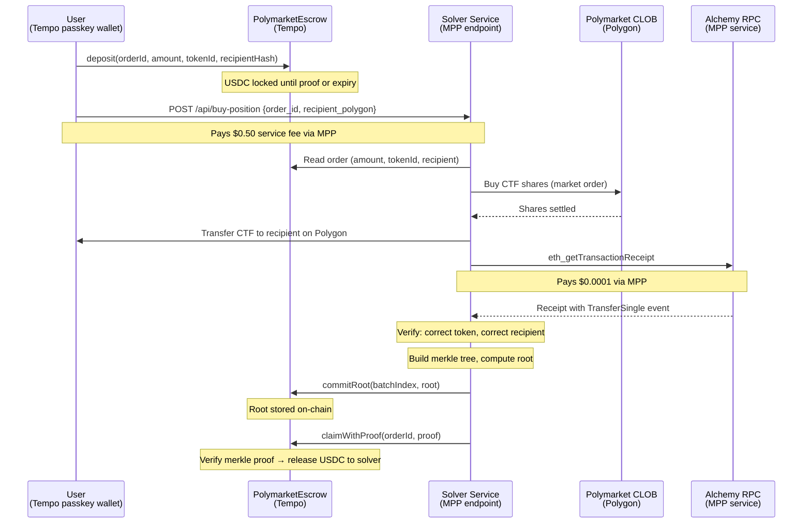
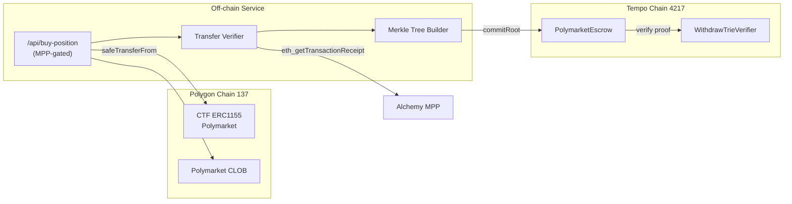

# Cross-Chain Polymarket Solver on MPP

Cross-chain actions, not cross-chain tokens. Pay on Tempo, get a Polymarket position on Polygon. No bridging, no multi-chain wallet juggling. One API call, one payment.

Settlement is cryptographic: the solver proves delivery with a merkle proof verified on-chain. No optimistic challenge period. The verification uses Alchemy via MPP. MPP all the way down.

## Architecture





## Payment Model

| Payment | What | Who pays | How | Amount |
|---------|------|----------|-----|--------|
| Position funds | USDC for CTF purchase | User | Escrow deposit (trustless) | Variable |
| Service fee | Solver orchestration | User | MPP | $0.50 |
| Verification | Polygon tx receipt | Solver | MPP (Alchemy) | $0.0001 |
| Settlement | Solver claims from escrow | Escrow contract | On-chain merkle proof | 0 |

## Endpoints

| Method | Path | Cost | Description |
|--------|------|------|-------------|
| GET | `/api/polymarket?q=bitcoin` | 0.10 USDC | Search Polymarket markets |
| POST | `/api/buy-position` | 0.50 USDC | Buy position via escrow or direct |
| GET | `/api/proof?orderId=0x...` | free | Merkle proof for escrow claim |

## Contracts

| Contract | Address | Chain |
|----------|---------|-------|
| PolymarketEscrow | `0x7331A38bAa80aa37d88D893Ad135283c34c40370` | Tempo (4217) |
| CTF (Polymarket) | `0x4D97DCd97eC945f40cF65F87097ACe5EA0476045` | Polygon (137) |

## Merkle Proof Format

Same leaf format as t1's `T1XChainReader`:

```
leaf = keccak256(abi.encodePacked(
    keccak256(abi.encodePacked(orderId, polygonTxHash)),
    orderId
))
```

The `WithdrawTrieVerifier` library (59 lines, from t1) verifies inclusion against the committed root using position-based binary merkle proofs.

## Quick Start

```bash
bun install
bun dev

# Search markets
tempo request -t -X GET "http://localhost:3000/api/polymarket?q=bitcoin"

# End-to-end escrow test (deposit → buy → prove → claim)
bun run scripts/test-escrow.ts
```

VPN required (non-US) for CLOB order placement. Polymarket geoblocks US IPs.

## Accounts

| Role | Address | Type |
|------|---------|------|
| User | `0xEF0726eBc08C1f89DEdF559163B7eC367C98C857` | Tempo passkey wallet |
| User (scoped key) | `0x3Fec086381Ada1FdA646a3338739440f2F8276f9` | $100 spending cap, 30-day expiry |
| Solver | `0xa0dF29753C297cf0975e55B6bE7516EbB9A94fA9` | EOA on Polygon + Tempo |

## File Structure

```
contracts/
  src/PolymarketEscrow.sol      Escrow + merkle proof verification
  src/WithdrawTrieVerifier.sol   Binary merkle proof library (from t1)
src/
  lib/fulfillment.ts             Merkle tree builder, root poster, transfer verification
  lib/polymarket.ts              Gamma API, CLOB client, CTF transfer
  app/api/buy-position/route.ts  MPP-gated solver (escrow + direct modes)
  app/api/proof/route.ts         Proof retrieval
  app/api/polymarket/route.ts    Market search
scripts/
  test-escrow.ts                 Full e2e test
docs/
  demo-runbook.md                Step-by-step demo commands
  tempo-developer-friction.md    DX issues for Tempo team
  TODO.md                        Known gaps
```

## Proven E2E Flow

Tested on Tempo mainnet + Polygon mainnet, 2026-03-18:

| Step | Tx |
|------|----|
| Escrow deposit | Tempo |
| CTF purchase | Polymarket CLOB order `0x3820...` |
| CTF transfer | [Polygon `0x9896...`](https://polygonscan.com/tx/0x9896ada0ea4ba45d7cf10cc2b699f5e307ca63635438627806fa574690d57b5e) |
| Root committed | Tempo (batch 1, root `0x5258...`) |
| Claim with proof | Tempo (order settled ✓) |

## Future Work

Full position lifecycle management. The solver watches the position and sells at a target price, transferring proceeds back to the user on Tempo. Make money on a foreign chain without ever touching it.

LLM-powered market discovery. An agent searches markets, evaluates liquidity and pricing, and constructs the deposit intent for the user to sign. The agent uses MPP to search, MPP to fill, and MPP to verify.

## Developer Friction

See [tempo-developer-friction.md](docs/tempo-developer-friction.md) for issues encountered building on Tempo, including viem transaction support, foundry deployment, and Alchemy MPP auth.
